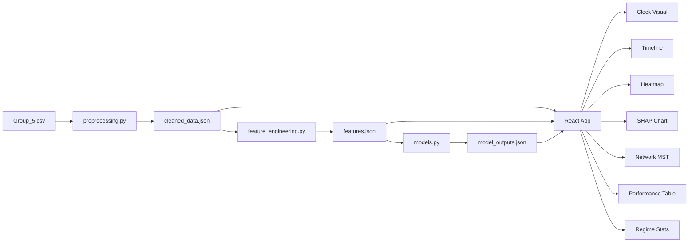

# Design Document: Financial Fragility Clock

## Overview

The Financial Fragility Clock is a static-site dashboard that visualizes financial market fragility using the Istanbul Stock Exchange (ISE) dataset through the lens of Minsky's Financial Instability Hypothesis. The system architecture follows a three-tier approach: Python-based ML pipeline for data processing and model training, static JSON artifacts for data storage, and a React-based dashboard for interactive visualization.

### Core Design Principles

1. **Static Architecture**: All computation happens at build time; the dashboard consumes precomputed JSON files with no backend API
2. **Separation of Concerns**: Clear boundaries between data processing (Python), data storage (JSON), and presentation (React)
3. **Regime-Aware Analysis**: All models and visualizations are designed to handle three distinct Minsky regimes (HEDGE, SPECULATIVE, PONZI)
4. **Reproducibility**: Complete pipeline from raw CSV to deployed dashboard is scripted and version-controlled
5. **Performance First**: Precomputation and memoization ensure sub-200ms interaction latency

### System Context

The system processes 536 daily observations (Jan 2009 - Aug 2011) of 8 global market indices, computing rolling correlations, permutation entropy, and Minsky regime labels. Three machine learning models (OLS, Random Forest, optional LSTM) predict ISE returns, with SHAP explainability providing feature importance. The dashboard presents these outputs through seven interactive components synchronized via a date scrubber.

### Key Constraints

- No backend server or database (static site deployment to Vercel)
- All data must fit in browser memory (~5MB JSON total)
- Initial page load must complete within 3 seconds
- Date scrubber updates must complete within 200ms
- Must support keyboard-only navigation for accessibility and presentation mode

## Architecture

### System Architecture

```
┌─────────────────────────────────────────────────────────────┐
│                     ML Pipeline (Python)                     │
│  ┌──────────────┐  ┌──────────────┐  ┌──────────────┐      │
│  │ Preprocessing│→ │   Feature    │→ │    Models    │      │
│  │   Module     │  │ Engineering  │  │    Module    │      │
│  └──────────────┘  └──────────────┘  └──────────────┘      │
│         ↓                  ↓                  ↓              │
│  cleaned_data.json   features.json   model_outputs.json     │
└─────────────────────────────────────────────────────────────┘
                              ↓
┌─────────────────────────────────────────────────────────────┐
│                  React Dashboard (Frontend)                  │
│  ┌──────────────────────────────────────────────────────┐   │
│  │              Static JSON Imports                      │   │
│  └──────────────────────────────────────────────────────┘   │
│         ↓                  ↓                  ↓              │
│  ┌──────────────┐  ┌──────────────┐  ┌──────────────┐      │
│  │ Date Context │→ │  Components  │→ │    Routes    │      │
│  │   Provider   │  │  (7 charts)  │  │ (3 routes)   │      │
│  └──────────────┘  └──────────────┘  └──────────────┘      │
└─────────────────────────────────────────────────────────────┘
                              ↓
                    Vercel Static Hosting
```

### Data Flow Architecture



### Technology Stack

**Python ML Pipeline:**
- Python 3.9+
- pandas 1.5+ (data manipulation)
- numpy 1.24+ (numerical computation)
- scikit-learn 1.2+ (Random Forest, cross-validation)
- statsmodels 0.14+ (OLS regression, diagnostic tests)
- shap 0.42+ (SHAP explainability)
- scipy 1.10+ (permutation entropy, statistical tests)

**React Dashboard:**
- React 18.2+ (UI framework)
- Vite 4.0+ (build tool)
- Recharts 2.5+ (declarative charts: AreaChart, BarChart)
- D3.js 7.8+ (custom visualizations: MST network, heatmap)
- CSS Modules (scoped styling)

**Deployment:**
- Vercel (static site hosting with CDN)
- GitHub Actions (optional CI/CD for automated builds)

### Module Boundaries

**Python Modules:**
1. `preprocessing.py`: CSV parsing, missing value handling, datetime conversion, validation
2. `feature_engineering.py`: Rolling correlation, permutation entropy, Minsky regime labeling, fragility score
3. `models.py`: OLS, Random Forest, LSTM training, SHAP computation, performance comparison
4. `export_json.py`: Orchestration script that runs all modules and writes JSON outputs

**React Components:**
1. `ClockVisual.jsx`: SVG circular gauge with animated needle
2. `RegimeTimeline.jsx`: Recharts AreaChart with event markers
3. `DateScrubber.jsx`: Controlled slider with debouncing
4. `CorrelationHeatmap.jsx`: Custom SVG grid with D3 color scale
5. `SHAPChart.jsx`: Recharts BarChart with regime toggle
6. `NetworkMST.jsx`: D3 force-directed graph
7. `ModelPerformanceTable.jsx`: Styled HTML table
8. `RegimeStatsCard.jsx`: Grid layout with sparklines

**Context Providers:**
1. `DateContext.jsx`: Global state for selected date, provides update function to all components

## Components and Interfaces

### Python Module Interfaces

#### Preprocessing Module

```python
def load_csv(filepath: str) -> pd.DataFrame:
    """
    Parse ISE dataset CSV with flexible delimiter and date format detection.
    
    Args:
        filepath: Path to Group_5.csv
        
    Returns:
        DataFrame with datetime index and 8 numeric columns
        
    Raises:
        FileNotFoundError: If CSV file doesn't exist
        ValueError: If row count != 536 after parsing
    """

def handle_missing_values(df: pd.DataFrame, max_gap: int = 3) -> pd.DataFrame:
    """
    Forward-fill missing values for gaps <= max_gap days, flag longer gaps.
    
    Args:
        df: Raw DataFrame with potential NaN values
        max_gap: Maximum consecutive days to forward-fill
        
    Returns:
        DataFrame with missing values handled, flagged rows excluded
    """

def compute_descriptive_stats(df: pd.DataFrame) -> dict:
    """
    Compute mean, std, min, max, quartiles for all numeric columns.
    
    Returns:
        Dictionary with column names as keys, stats dict as values
    """

def export_cleaned_data(df: pd.DataFrame, stats: dict, filepath: str) -> None:
    """
    Write cleaned data and metadata to JSON.
    
    JSON structure:
    {
        "metadata": {"rows": 536, "columns": 8, "date_range": [...], "stats": {...}},
        "data": [{"date": "2009-01-05", "ISE_USD": 0.0123, ...}, ...]
    }
    """
```

#### Feature Engineering Module

```python
def compute_rolling_correlation(df: pd.DataFrame, window: int = 60) -> pd.DataFrame:
    """
    Compute pairwise rolling Pearson correlations for all indices.
    
    Args:
        df: DataFrame with 8 market indices
        window: Rolling window size in days
        
    Returns:
        DataFrame with columns: date, mean_corr, corr_concentration, max_eigenvalue,
        plus 28 pairwise correlation columns (8 choose 2)
    """

def compute_permutation_entropy(series: pd.Series, m: int = 3, delay: int = 1, 
                                window: int = 30) -> pd.Series:
    """
    Compute rolling permutation entropy on return series.
    
    Args:
        series: Time series (e.g., ISE_USD returns)
        m: Embedding dimension
        delay: Time delay
        window: Rolling window size
        
    Returns:
        Series of permutation entropy values (0 = ordered, 1 = random)
    """

def label_minsky_regime(mean_corr: pd.Series, volatility: pd.Series) -> pd.Series:
    """
    Classify each observation into HEDGE, SPECULATIVE, or PONZI regime.
    
    Thresholds:
    - HEDGE: mean_corr < 0.4 AND volatility < 0.8 * median_vol
    - PONZI: mean_corr > 0.7 AND volatility > 1.5 * median_vol
    - SPECULATIVE: otherwise
    
    Returns:
        Series of regime labels (categorical)
    """

def compute_fragility_score(corr: pd.Series, pe: pd.Series, vol: pd.Series, 
                            rf_error: pd.Series) -> pd.Series:
    """
    Compute composite fragility score using weighted formula.
    
    Formula: 0.4*corr_norm + 0.3*(1-pe_norm) + 0.2*vol_norm + 0.1*rf_error_norm
    All components min-max normalized to [0,1], final score scaled to [0,100]
    
    Returns:
        Series of fragility scores (0-100)
    """

def export_features(features_df: pd.DataFrame, filepath: str) -> None:
    """
    Write feature time series to JSON.
    
    JSON structure:
    {
        "metadata": {"features": [...], "date_range": [...]},
        "data": [{"date": "2009-01-05", "mean_corr": 0.45, "regime": "HEDGE", ...}, ...]
    }
    """
```

#### Models Module

```python
def train_ols(X_train: pd.DataFrame, y_train: pd.Series, 
              X_test: pd.DataFrame, y_test: pd.Series) -> dict:
    """
    Train OLS regression and compute diagnostics.
    
    Returns:
        {
            "coefficients": {"SP500": 0.45, ...},
            "metrics": {"train_r2": 0.78, "test_r2": 0.72, "test_rmse": 0.012, ...},
            "regime_rmse": {"HEDGE": 0.008, "SPECULATIVE": 0.011, "PONZI": 0.018},
            "diagnostics": {"durbin_watson": 1.95, "breusch_pagan_p": 0.03}
        }
    """

def train_random_forest(X_train: pd.DataFrame, y_train: pd.Series,
                       X_test: pd.DataFrame, y_test: pd.Series,
                       regimes: pd.Series) -> dict:
    """
    Train Random Forest with TimeSeriesSplit cross-validation.
    
    Hyperparameters: n_estimators=500, max_depth=10, min_samples_split=10
    
    Returns:
        {
            "metrics": {"cv_scores": [0.75, 0.78, ...], "test_r2": 0.81, ...},
            "regime_rmse": {"HEDGE": 0.007, "SPECULATIVE": 0.010, "PONZI": 0.015},
            "feature_importance": {"gini": {...}, "permutation": {...}}
        }
    """

def compute_shap_values(model, X_test: pd.DataFrame, regimes: pd.Series) -> dict:
    """
    Compute SHAP values using TreeExplainer.
    
    Returns:
        {
            "shap_matrix": [[0.002, -0.001, ...], ...],  # shape: (n_test, n_features)
            "feature_names": ["SP500", "DAX", ...],
            "mean_abs_shap": {"SP500": 0.0045, ...},
            "regime_shap": {
                "HEDGE": {"dominant_feature": "SP500", "mean_abs_shap": {...}},
                "SPECULATIVE": {...},
                "PONZI": {...}
            }
        }
    """

def compare_models(ols_results: dict, rf_results: dict, 
                  lstm_results: dict = None) -> dict:
    """
    Generate model comparison table and identify best performers.
    
    Returns:
        {
            "comparison_table": [
                {"model": "OLS", "r2": 0.72, "rmse": 0.012, ...},
                {"model": "RF", "r2": 0.81, "rmse": 0.009, ...}
            ],
            "best_model": {"r2": "RF", "rmse": "RF", ...},
            "rf_improvement_pct": {"r2": 12.5, "rmse": 25.0, ...},
            "ponzi_validation": {"rf_better": true, "improvement_pct": 16.7}
        }
    """

def export_model_outputs(ols: dict, rf: dict, shap: dict, 
                        comparison: dict, filepath: str) -> None:
    """
    Write all model results to JSON.
    
    JSON structure:
    {
        "metadata": {"timestamp": "...", "python_version": "...", "libraries": {...}},
        "ols": {...},
        "random_forest": {...},
        "shap": {...},
        "comparison": {...}
    }
    """
```

### React Component Interfaces

#### DateContext

```typescript
interface DateContextValue {
  selectedDate: Date;
  setSelectedDate: (date: Date) => void;
  dateRange: [Date, Date];
  keyEvents: Array<{date: Date; label: string}>;
}

const DateContext = React.createContext<DateContextValue>(null);
```

#### ClockVisual Component

```typescript
interface ClockVisualProps {
  fragilityScore: number;  // 0-100
  regime: 'HEDGE' | 'SPECULATIVE' | 'PONZI';
  date: Date;
  trend: 'up' | 'down' | 'stable';  // 30-day trend
  dominantSource: string;  // e.g., "SP500"
  keyEvents: Array<{date: Date; label: string}>;
}

// Internal state for animation
interface ClockVisualState {
  currentAngle: number;  // Animated needle angle
  isPulsing: boolean;    // Regime threshold crossing animation
}
```

#### RegimeTimeline Component

```typescript
interface RegimeTimelineProps {
  data: Array<{
    date: Date;
    fragilityScore: number;
    regime: 'HEDGE' | 'SPECULATIVE' | 'PONZI';
  }>;
  keyEvents: Array<{date: Date; label: string}>;
  onDateClick: (date: Date) => void;
}
```

#### CorrelationHeatmap Component

```typescript
interface CorrelationHeatmapProps {
  correlationMatrix: number[][];  // 8x8 matrix
  indices: string[];  // ["SP500", "DAX", ...]
  date: Date;
  previousMatrix?: number[][];  // For computing 30-day delta
}

interface HeatmapCell {
  row: number;
  col: number;
  value: number;
  delta: number | null;
}
```

#### SHAPChart Component

```typescript
interface SHAPChartProps {
  shapData: {
    HEDGE: Record<string, number>;
    SPECULATIVE: Record<string, number>;
    PONZI: Record<string, number>;
  };
  selectedRegime: 'HEDGE' | 'SPECULATIVE' | 'PONZI';
  onRegimeChange: (regime: string) => void;
}
```

#### NetworkMST Component

```typescript
interface NetworkMSTProps {
  correlationMatrix: number[][];
  indices: string[];
  date: Date;
}

interface MSTNode {
  id: string;
  centrality: number;
  volatility: number;  // For color coding
}

interface MSTEdge {
  source: string;
  target: string;
  weight: number;  // Mantegna distance
}
```

### Data File Schemas

#### cleaned_data.json

```json
{
  "metadata": {
    "rows": 536,
    "columns": 8,
    "date_range": ["2009-01-05", "2011-08-31"],
    "stats": {
      "ISE_USD": {"mean": 0.0012, "std": 0.0234, "min": -0.0567, "max": 0.0789, "q25": -0.0089, "q50": 0.0011, "q75": 0.0123},
      "SP500": {...},
      ...
    }
  },
  "data": [
    {"date": "2009-01-05", "ISE_USD": 0.0123, "SP500": -0.0045, "DAX": 0.0067, ...},
    ...
  ]
}
```

#### features.json

```json
{
  "metadata": {
    "features": ["mean_corr", "corr_concentration", "max_eigenvalue", "permutation_entropy", "rolling_volatility", "regime", "fragility_score"],
    "date_range": ["2009-01-05", "2011-08-31"]
  },
  "data": [
    {
      "date": "2009-01-05",
      "mean_corr": 0.45,
      "corr_concentration": 0.12,
      "max_eigenvalue": 4.2,
      "permutation_entropy": 0.78,
      "rolling_volatility": 0.023,
      "regime": "HEDGE",
      "fragility_score": 32.5,
      "pairwise_correlations": {
        "SP500_DAX": 0.67,
        "SP500_FTSE": 0.72,
        ...
      }
    },
    ...
  ]
}
```

#### model_outputs.json

```json
{
  "metadata": {
    "timestamp": "2024-01-15T10:30:00Z",
    "python_version": "3.9.7",
    "libraries": {"pandas": "1.5.3", "scikit-learn": "1.2.2", "shap": "0.42.1"}
  },
  "ols": {
    "coefficients": {"SP500": 0.45, "DAX": 0.23, ...},
    "metrics": {"train_r2": 0.78, "test_r2": 0.72, "test_rmse": 0.012, "test_mae": 0.009},
    "regime_rmse": {"HEDGE": 0.008, "SPECULATIVE": 0.011, "PONZI": 0.018},
    "diagnostics": {"durbin_watson": 1.95, "breusch_pagan_p": 0.03}
  },
  "random_forest": {
    "metrics": {
      "cv_scores": [0.75, 0.78, 0.80, 0.77, 0.79],
      "cv_mean": 0.778,
      "cv_std": 0.018,
      "test_r2": 0.81,
      "test_rmse": 0.009,
      "test_mae": 0.007
    },
    "regime_rmse": {"HEDGE": 0.007, "SPECULATIVE": 0.010, "PONZI": 0.015},
    "feature_importance": {
      "gini": {"SP500": 0.25, "mean_corr": 0.18, ...},
      "permutation": {"SP500": 0.22, "DAX": 0.15, ...}
    }
  },
  "shap": {
    "shap_matrix": [[0.002, -0.001, 0.003, ...], ...],
    "feature_names": ["SP500", "DAX", "FTSE", "NIKKEI", "BOVESPA", "EU", "EM", "mean_corr", "permutation_entropy", "regime_encoded"],
    "mean_abs_shap": {"SP500": 0.0045, "mean_corr": 0.0038, ...},
    "regime_shap": {
      "HEDGE": {"dominant_feature": "SP500", "mean_abs_shap": {"SP500": 0.0052, ...}},
      "SPECULATIVE": {"dominant_feature": "mean_corr", "mean_abs_shap": {"mean_corr": 0.0048, ...}},
      "PONZI": {"dominant_feature": "mean_corr", "mean_abs_shap": {"mean_corr": 0.0067, ...}}
    }
  },
  "comparison": {
    "comparison_table": [
      {"model": "OLS", "r2": 0.72, "rmse": 0.012, "mae": 0.009, "hedge_rmse": 0.008, "spec_rmse": 0.011, "ponzi_rmse": 0.018},
      {"model": "RF", "r2": 0.81, "rmse": 0.009, "mae": 0.007, "hedge_rmse": 0.007, "spec_rmse": 0.010, "ponzi_rmse": 0.015}
    ],
    "best_model": {"r2": "RF", "rmse": "RF", "mae": "RF", "ponzi_rmse": "RF"},
    "rf_improvement_pct": {"r2": 12.5, "rmse": 25.0, "mae": 22.2, "ponzi_rmse": 16.7},
    "ponzi_validation": {"rf_better": true, "improvement_pct": 16.7}
  }
}
```

## Data Models

### Core Domain Models

#### MarketObservation

Represents a single day's market data across all indices.

```python
@dataclass
class MarketObservation:
    date: datetime
    ise_usd: float
    sp500: float
    dax: float
    ftse: float
    nikkei: float
    bovespa: float
    eu: float
    em: float
    
    def to_dict(self) -> dict:
        return {
            "date": self.date.isoformat(),
            "ISE_USD": self.ise_usd,
            "SP500": self.sp500,
            "DAX": self.dax,
            "FTSE": self.ftse,
            "NIKKEI": self.nikkei,
            "BOVESPA": self.bovespa,
            "EU": self.eu,
            "EM": self.em
        }
```

#### FeatureSet

Represents engineered features for a single observation.

```python
@dataclass
class FeatureSet:
    date: datetime
    mean_correlation: float
    correlation_concentration: float
    max_eigenvalue: float
    permutation_entropy: float
    rolling_volatility: float
    regime: MinskyRegime
    fragility_score: float
    pairwise_correlations: dict[str, float]
    
    def to_dict(self) -> dict:
        return {
            "date": self.date.isoformat(),
            "mean_corr": self.mean_correlation,
            "corr_concentration": self.correlation_concentration,
            "max_eigenvalue": self.max_eigenvalue,
            "permutation_entropy": self.permutation_entropy,
            "rolling_volatility": self.rolling_volatility,
            "regime": self.regime.value,
            "fragility_score": self.fragility_score,
            "pairwise_correlations": self.pairwise_correlations
        }
```

#### MinskyRegime

Enumeration of the three financial stability regimes.

```python
from enum import Enum

class MinskyRegime(Enum):
    HEDGE = "HEDGE"
    SPECULATIVE = "SPECULATIVE"
    PONZI = "PONZI"
    
    @property
    def color(self) -> str:
        return {
            MinskyRegime.HEDGE: "#2d6a4f",
            MinskyRegime.SPECULATIVE: "#e9a800",
            MinskyRegime.PONZI: "#c1121f"
        }[self]
    
    @property
    def threshold_range(self) -> tuple[int, int]:
        return {
            MinskyRegime.HEDGE: (0, 33),
            MinskyRegime.SPECULATIVE: (34, 66),
            MinskyRegime.PONZI: (67, 100)
        }[self]
```

#### ModelResults

Container for model training outputs.

```python
@dataclass
class ModelResults:
    model_name: str
    coefficients: dict[str, float] | None  # OLS only
    metrics: dict[str, float]
    regime_rmse: dict[str, float]
    feature_importance: dict[str, dict[str, float]] | None  # RF only
    diagnostics: dict[str, float] | None  # OLS only
    
    def to_dict(self) -> dict:
        result = {
            "metrics": self.metrics,
            "regime_rmse": self.regime_rmse
        }
        if self.coefficients:
            result["coefficients"] = self.coefficients
        if self.feature_importance:
            result["feature_importance"] = self.feature_importance
        if self.diagnostics:
            result["diagnostics"] = self.diagnostics
        return result
```

#### SHAPResults

Container for SHAP explainability outputs.

```python
@dataclass
class SHAPResults:
    shap_matrix: np.ndarray  # shape: (n_observations, n_features)
    feature_names: list[str]
    mean_abs_shap: dict[str, float]
    regime_shap: dict[str, dict]
    
    def to_dict(self) -> dict:
        return {
            "shap_matrix": self.shap_matrix.tolist(),
            "feature_names": self.feature_names,
            "mean_abs_shap": self.mean_abs_shap,
            "regime_shap": self.regime_shap
        }
```

### React State Models

#### DashboardState

Global application state managed by DateContext.

```typescript
interface DashboardState {
  selectedDate: Date;
  dateRange: [Date, Date];
  keyEvents: KeyEvent[];
  cleanedData: MarketObservation[];
  features: FeatureSet[];
  modelOutputs: ModelOutputs;
}

interface KeyEvent {
  date: Date;
  label: string;
  description: string;
}

interface MarketObservation {
  date: string;  // ISO format
  ISE_USD: number;
  SP500: number;
  DAX: number;
  FTSE: number;
  NIKKEI: number;
  BOVESPA: number;
  EU: number;
  EM: number;
}

interface FeatureSet {
  date: string;
  mean_corr: number;
  corr_concentration: number;
  max_eigenvalue: number;
  permutation_entropy: number;
  rolling_volatility: number;
  regime: 'HEDGE' | 'SPECULATIVE' | 'PONZI';
  fragility_score: number;
  pairwise_correlations: Record<string, number>;
}

interface ModelOutputs {
  metadata: {
    timestamp: string;
    python_version: string;
    libraries: Record<string, string>;
  };
  ols: ModelResult;
  random_forest: ModelResult;
  shap: SHAPResult;
  comparison: ComparisonResult;
}
```

### Data Transformation Pipeline

The data flows through the following transformations:

1. **CSV → DataFrame**: `load_csv()` parses raw CSV into pandas DataFrame with datetime index
2. **DataFrame → CleanedData**: `handle_missing_values()` and validation produce clean DataFrame
3. **CleanedData → Features**: `compute_rolling_correlation()`, `compute_permutation_entropy()`, `label_minsky_regime()`, `compute_fragility_score()` produce feature DataFrame
4. **Features → ModelInputs**: Train/test split and feature selection prepare X, y arrays
5. **ModelInputs → ModelOutputs**: `train_ols()`, `train_random_forest()`, `compute_shap_values()` produce results dictionaries
6. **All → JSON**: `export_*()` functions serialize to JSON files
7. **JSON → React State**: Static imports and parsing load data into React context
8. **React State → Components**: Props drilling and context consumption provide data to visualizations

### Validation Rules

**Data Validation:**
- Date range must span exactly 536 observations
- All numeric columns must be finite (no inf values)
- Missing value gaps > 3 days must be flagged and excluded
- Correlation values must be in [-1, 1]
- Permutation entropy must be in [0, 1]
- Fragility score must be in [0, 100]

**Model Validation:**
- Train/test split must be time-based (no shuffling)
- Cross-validation must use TimeSeriesSplit (no standard k-fold)
- SHAP values must sum to model prediction (additive property)
- Regime-specific RMSE must be computed on test set only

**Component Validation:**
- Selected date must be within dateRange
- Clock needle angle must be in [0, 360] degrees
- Heatmap correlation matrix must be symmetric
- Network MST must have exactly n-1 edges for n nodes

